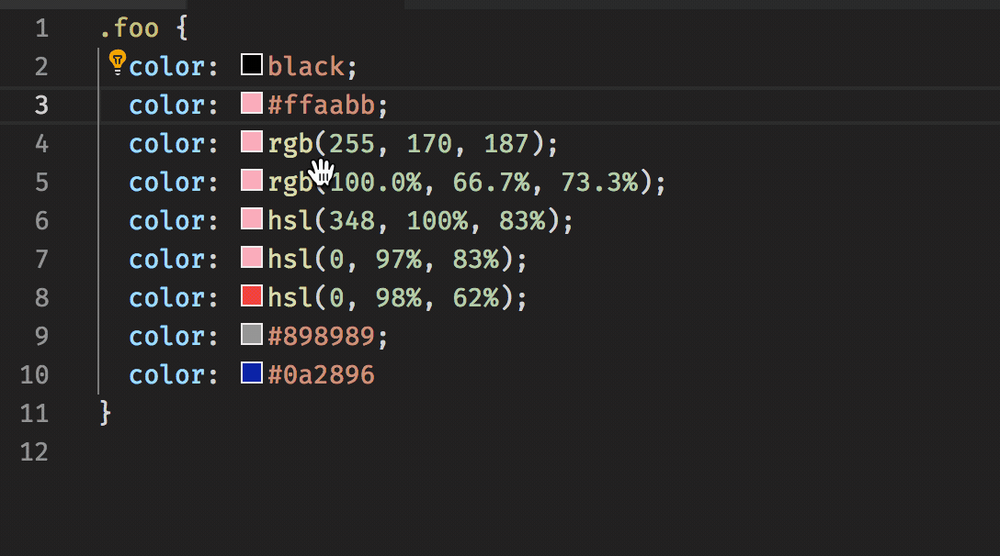

# vscode-color-exchange README

A VS code extension uses `VS code`'s code action for refactoring your color unit code. It can transform your color unit to RGB, RGBA, etc.

## Features
convert your color token to:
- RGB, RGBA
- HSL
- 6-dight hexadecimal and 3-dight hexadecimal(if available)

## Requirements
`vs code` >=1.27.0

## TODOS
- [ ] add more unit test
- [ ] support convert other color to keyword color if available
- [ ] add `codecov` for code coverage
## Known issues
- code action show some incorrect place, when cursor after `;` in `rgb(255, 255, 255);`

## Release Notes
### 1.0.0
Basic feature.

-----------------------------------------------------------------------------------------------------------
**Enjoy!**
